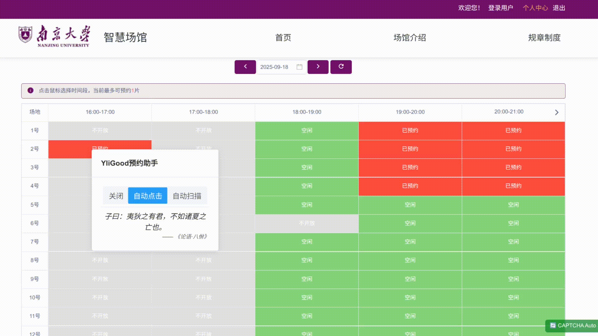
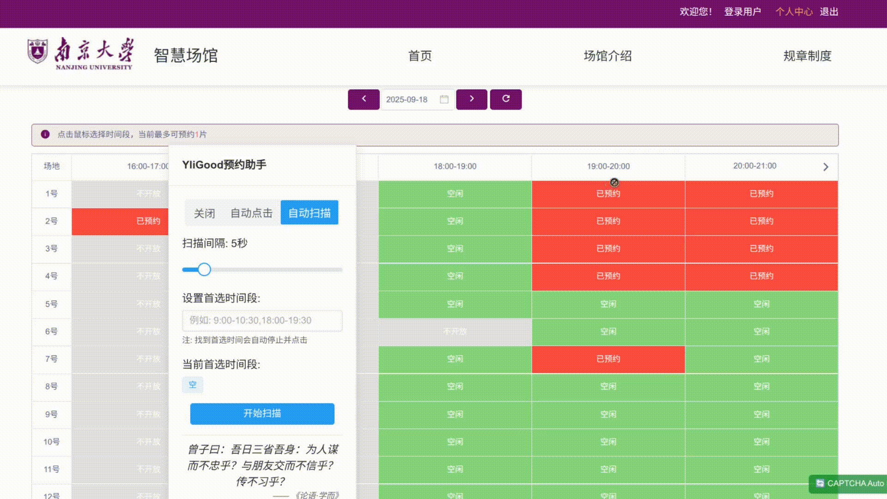

# YliGood Reservation

一个自动化工具，帮助用户轻松预约南京大学体育馆预约系统（ggtypt.nju.edu.cn）上的体育场馆。

<table width="100%" align="center">
   <tr>
      <td align="center">
          
         <b>一键预约演示</b>
      </td>
      <td align="center">
          
         <b>自动扫描演示</b>
      </td>
   </tr>
</table>

## ✨ 功能特色

- **自动扫描**：自动检测指定时间段内可预约场馆并进行预约。（如果需要八点钟抢场，请关闭预约尚未开始对话框，切换预约日期为前一天，然后开启自动扫描功能）
- **一键预约**：一键完成预约流程
- **自动识别**：自动识别并解决滑块验证码，无需人工干预（采取模拟点击方式，在识别过程中不要移动鼠标）

## 🚀 安装指南

### 方式一：脚本管理器

1. 安装 [Tampermonkey](https://www.tampermonkey.net/) 浏览器扩展
2. 点击[这里](https://github.com/rikiguan/YliGoodReservation/releases/)安装用户脚本
3. 访问 [南京大学体育馆预约系统](https://ggtypt.nju.edu.cn/venue/venue-introduce) 即可自动启用工具。（ps. https://ggtypt.nju.edu.cn/venue/venue-introduce 必须加后面的地址，要不然会404）

### 方式二：浏览器扩展

如果需求较多，可能会打包浏览器扩展，敬请期待！
## 🔒 隐私声明

- 本插件仅在南京大学体育馆预约系统网站运行
- 不收集或传输任何个人数据，可能会收集匿名的使用数据以帮助改进插件
- 所有操作均在本地浏览器完成

## 🛠️ 技术栈

- Vue 3
- TypeScript
- Pinia
- Element Plus

## ✅ 贡献指南

欢迎提交问题和功能请求！如果你想贡献代码：

1. Fork 本仓库
2. 创建你的功能分支（`git checkout -b feature/amazing-feature`）
3. 提交你的更改（`git commit -m 'Add some amazing feature'`）
4. 推送到分支（`git push origin feature/amazing-feature`）
5. 创建 Pull Request

## 联系方式

有问题或建议？欢迎通过以下方式联系我们：

- 在 GitHub 上提交 [issue](https://github.com/rikiguan/YliGoodReservation/issues)

---

**免责声明**：本项目仅供学习和研究使用，请遵守相关平台的服务条款。
